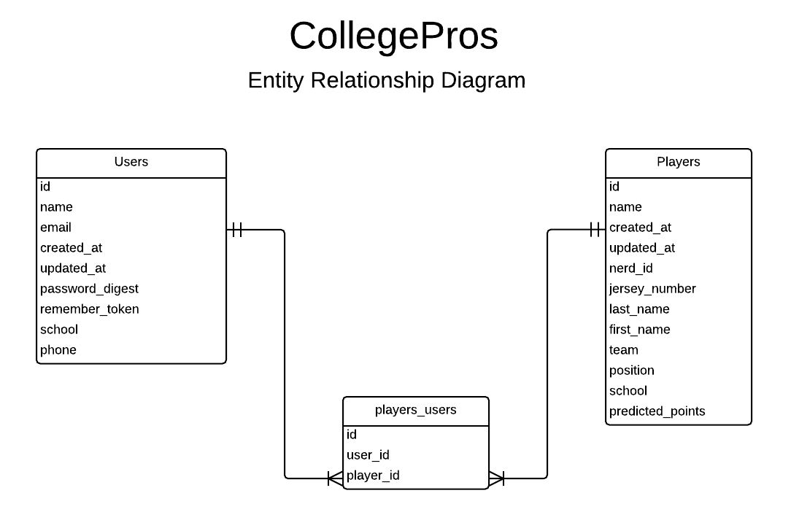

#Josh's GitHub README for CollegePros   

##General Assembly WDI: Project 1

 

##Overview
________

CollegePros is a web application that allows users to follow their alma mater's college football players as they make the leap to the NFL using Fantasy Nerd's API. Users choose their alma mater as they sign up, and then can choose to the NFL players that attended their university.  The app will give users the ability to see each player's predicted fantasy points for the upcoming week.
 
##Technolgies Used
______

* Ruby 2.1.1
* Rails 4.1.1
* PostgreSQL Database
* Authentication & Authorization from scratch using b-crypt-ruby
* Fantasy Nerds API & HTTParty
* Testing using rspec-rails, capybara, and factory_girl_rails
 

##User Stories Completed
______
* As a User, I'm greeted with a small blurb on why CollegePros is awesome on the homepage.
* As a User, I am taken to the dashboard screen after signing in.
* As a User, I am taken to the dashboard after I have selected players.
* As a User, the dashboard will show me predicted fantasy point total for each player for the upcoming week. Each week, the projected totals will be updated.
* As a User, sign up screen should have fields...name, email, password, confirmation, and select school (school is dropdown with all schools of current NFL players).
* As a User, I can sign out of the application, which will redirect me to the sign in page/home page
 

##Production
__________
Explore [CollegePros](http://collegepros.heroku.com) on Heroku
 

##Backlog
_____________
Below is a full ERD of the CollegePros App.

